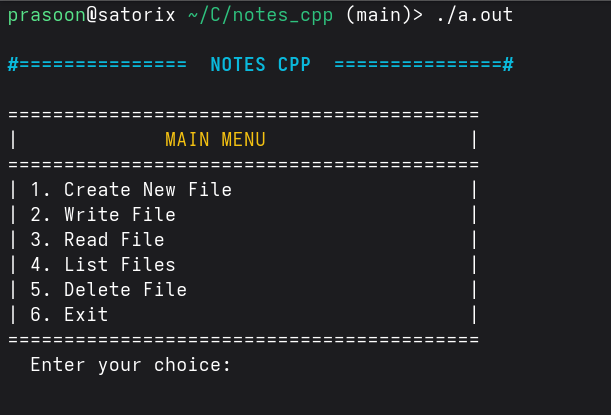

# Notes Cpp

**Notes Cpp** is a simple terminal-based notes app built with C++.

### Latest Release: v1.0

## Features

- Create a new file if it does not already exist
- Write content to an existing file (overwrite mode)
- Read and display saved file content in the terminal
- List all files currently stored in the notes directory
- Delete an existing file from the project directory.

## Requirements

- Linux/macOS/Windows
- C++17 compatible compiler (`g++` recommended)

## Storage Location

The app stores notes in a folder named `notes_cpp` inside your home directory.

## Usage

Use the main menu to choose one of the following options:

**Note**: Enter the complete file name, for example `new.txt`, not only `new`.

**1. Create New File**

- Create a new file if it does not already exist

**2. Write File**

- Write content on a newly created file or overwrite the content of an existing file.

**3. Read File**

- Read and display saved file content in the terminal

**4. List Files**

- List all files currently stored in the notes directory

**5. Delete File**

- Delete an existing file from the project directory.

**6. Exit**

- Exiting the program.
